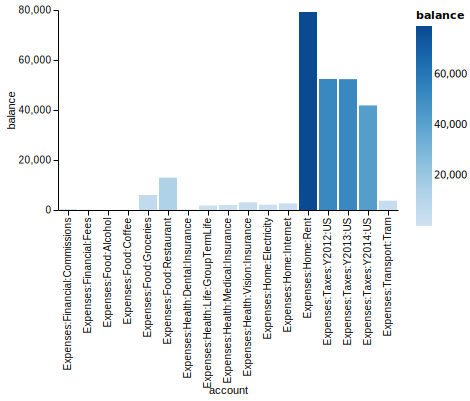

# Charts and Graphs

<div class=pagetoc>
<!-- toc -->
</div>

Tips and techniques for producing graphical charts. 

Generally we run a hledger report and
- select [CSV(/SSV/TSV) output](hledger.html#output-format) (-o foo.csv)
- disable the Total row (-N/--no-total))
- and show numbers apart from their commodity symbols (--commodity-column; or in hledger master, --layout=bare)

Eg:
```
hledger bal assets liabilities --no-total --commodity-column -o report.csv
```

Then there are many ways to convert CSV to charts.

<!-- toc -->

## Spreadsheet

Drag the CSV file into your favourite spreadsheet app and use its charting tools.

## ploterific

[ploterific](https://github.com/GregorySchwartz/ploterific) (`stack install hvega-theme ploterific`) produces simple charts,
in a HTML file that uses the [Vega-Lite](https://vega.github.io/vega-lite/) javascript library.
Charts can also be saved as SVG or PNG. An example:

```
hledger -f examples/bcexample.hledger bal -O csv -N expenses -3 cur:USD \
    | sed 's/ USD//' \
    | ploterific -m Bar -f account:N -f balance:Q -c account -o a.html \
    && open a.html
```


Let's break down that command line:

- `-f examples/bcexample.hledger` - use this example file in the hledger repo. Omit this to use your default journal.
- `bal` - run a [balance report](hledger.html#balance)
- `-O csv` - show it as [CSV](hledger.html#output-format) on stdout
- `-N` - disable the final Total row
- `expenses` - [limit](hledger.html#queries) to accounts whose name contains `expenses`
- `-3` - summarise accounts to [depth](hledger.html#depth) 3 and above
- `cur:USD` - limit to balances in `USD` currency. If you use the `$` symbol, it would be `cur:\\$`.
- `sed 's/ USD//g'` - process the output with [sed](https://www.gnu.org/software/sed/), stripping the ` USD` symbols to leave bare numbers for ploterific. With `$` it would be `sed 's/\$//g'`.
- `-m Bar` - use `Bar` as the Vega-Lite [mark type](https://hackage.haskell.org/package/hvega-0.11.0.1/docs/Graphics-Vega-VegaLite.html#t:Mark)
- `-f account:N` - use the `account` column as the first feature (X axis), treating values as names
- `-f balance:Q` - use the `balance` column as a second feature (Y axis), treating values as quantities
- `-c account` - use `account` values to select colours
- `-o a.html` - save into a temporary HTML file
- `&& open a.html` - and view it in your web browser, on Mac; on other systems it might be `xdg-open` or `start`

Here is the same chart but with the colour set by the balance:

```
hledger -f examples/bcexample.hledger bal -O csv -N expenses -3 cur:USD \
    | sed 's/ USD//' \
    | ploterific -m Bar -f account:N -f balance:Q -c balance:Q -o a.html
```



## gnuplot, R, other

Check out the tools at <https://plaintextaccounting.org/#reports>
(hreports, ledger-plot, ledger-plots, ludget, r-ledger..)
