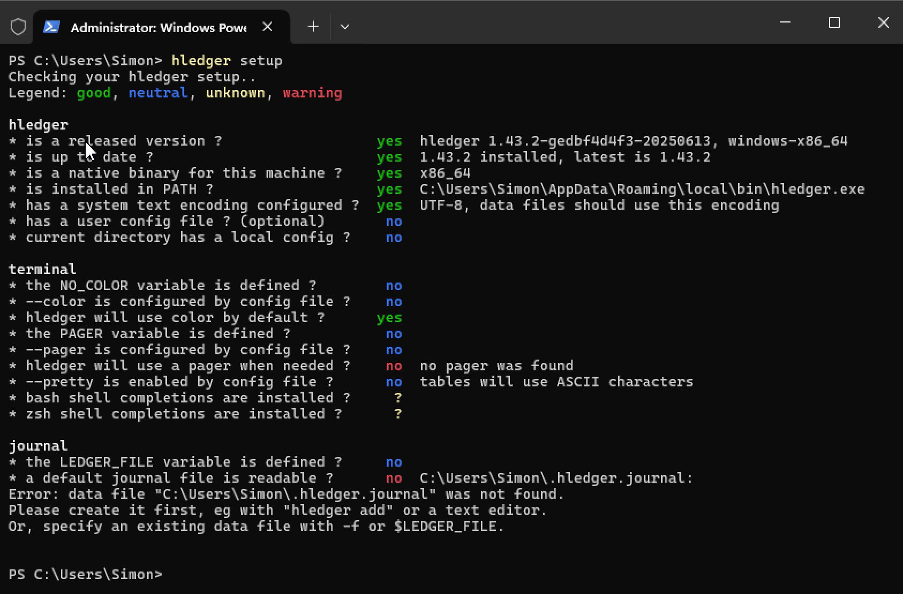

# Check your setup

You can run hledger's `setup` command at any time to check for configuration problems.
Eg on Windows, at this stage, it may be showing something like this:



You don't need to worry overmuch about what it says, but anything in red might need attention. (We'll make this less color-dependent in future. On Windows, ignore the pager and shell completions warnings for now.)

<!--
```
$ hledger setup
PS C:\Users\Simon> hledger setup
Checking your hledger setup..
Legend: good, neutral, unknown, warning

hledger
* is a released version ?                  yes  hledger 1.43.2-gedbf4d4f3-20250613, windows-x86_64
* is up to date ?                          yes  1.43.2 installed, latest is 1.43.2
* is a native binary for this machine ?    yes  x86_64
* is installed in PATH ?                   yes  C:\Users\Simon\AppData\Roaming\local\bin\hledger.exe
* has a system text encoding configured ?  yes  UTF-8, data files should use this encoding
* has a user config file ? (optional)       no
* current directory has a local config ?    no

terminal
* the NO_COLOR variable is defined ?        no
* --color is configured by config file ?    no
* hledger will use color by default ?      yes
* the PAGER variable is defined ?           no
* --pager is configured by config file ?    no
* hledger will use a pager when needed ?    no  no pager was found
* --pretty is enabled by config file ?      no  tables will use ASCII characters
* bash shell completions are installed ?     ?
* zsh shell completions are installed ?      ?

journal
* the LEDGER_FILE variable is defined ?     no
* a default journal file is readable ?      no  C:\Users\Simon\.hledger.journal:
Error: data file "C:\Users\Simon\.hledger.journal" was not found.
Please create it first, eg with "hledger add" or a text editor.
Or, specify an existing data file with -f or $LEDGER_FILE.


PS C:\Users\Simon>
```
-->

<br>

(Part of [hledger by example](hledger-by-example.md).)
