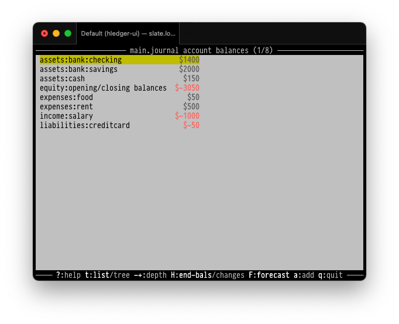
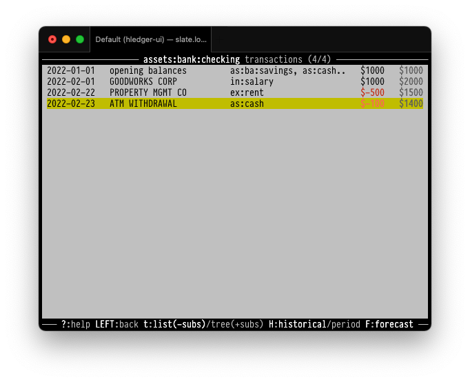
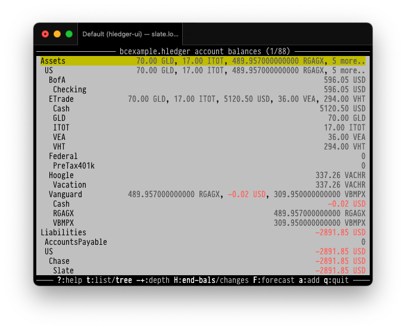
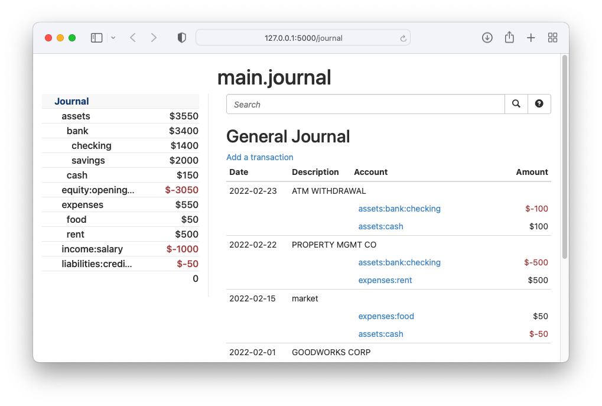
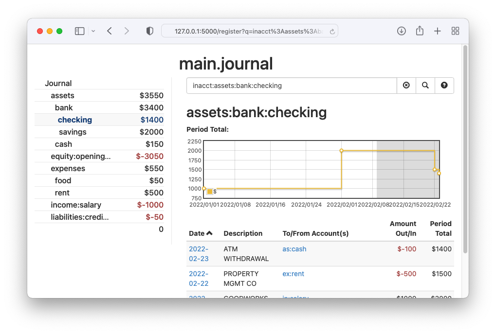
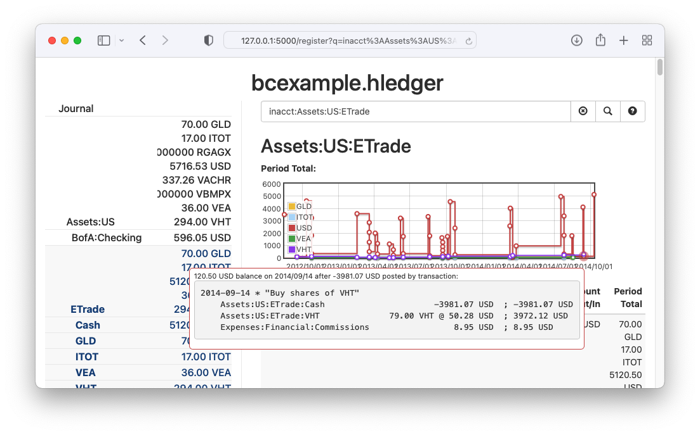

<!-- stylesheet at bottom -->


# hledger
<!-- 
This page's verbosity continually oscillates. General plan:
brief blurbs with links to more detail:
- what (& examples)
- why (& why not)
- who (for)
- how
-->

<!-- 
Tagline
https://www.stephendiehl.com/posts/marketing.html#persuasion-and-decision-makers :
1. It is memorable
2. It includes a key benefit
3. It differentiates
4. It imparts positivity
-->
<div id="tagline">
Fast, robust, intuitive<br>
plain text accounting.
</div>

<div class=pagetoc>
<!-- toc -->
</div>

## What is this ?

***hledger*** is free, high quality ***Plain Text Accounting*** software:
a fast and light multicurrency double-entry accounting system 
that uses human-readable, version-controllable plain text files,
and runs well on unix, mac and windows.

With it you can track your money, investments, cryptocurrencies, time, inventory, or any other commodity, 
with a complete history of changes, 
a documented future-proof data format,
and without needing any cloud service or vendor.
<!-- In other words, with privacy and peace of mind. -->

I'm Simon Michael, hledger project founder and PTA fan. Welcome! 

## Why use hledger ?
The [General FAQ](faq.html) or the [plaintextaccounting.org](https://plaintextaccounting.org) site introduce Plain Text Accounting.

Compared to [other PTA apps](https://plaintextaccounting.org/#software),
hledger has a strong focus on ease of use and practicality for day-to-day accounting.
It prioritises "just works" and accessible documentation,
and is actively maintained, with a lively [chat](support.html).
It supports most Ledger and Beancount features but omits some of the more complex ones
(value expression language, implicit lot matching).

Non-programmers will enjoy hledger's 
built-in financial statements, 
multi-period reports, 
choice of user interfaces, 
easy CSV import system
and general robustness.

Programmers may appreciate its
speed (25k txn/s on a macbook air m1), 
accuracy (up to 255 decimal places), 
reliability (1100+ tests, $100 bounty for regressions), 
and powerful extensibility/embeddability via Haskell scripts/apps.

Read more: [Why hledger ?](why.html)

(And why *not* use hledger ?
- If you need a rich GUI above all, you might prefer GnuCash, KMyMoney, or Quickbooks.
- If you like spreadsheets and don't need double entry, you might find those quicker.
- If you do a lot of advanced trading, or want to hack a lot with Python, consider Beancount.
- If you want to mix more code in your financial data, or hack on C++, evaluate Ledger.
- If you like minimalist unix tools and think all the above are bloat, see [pta](https://mandoc.bsd.lv/pta).
- If you are mobile-only and don't need version control or flexibility, maybe a phone app will do.
- If you don't need version control or privacy, but do need friction-free collaboration with financial professionals and institutions,
you'll prefer a commercial web-based system.)

[](https://github.com/simonmichael/hledger)

## How do I get started ?
Use any of these docs from the sidebar:
[Install](install.html),
[General FAQ](faq.html),
[Getting Started Guide](start.html),
[hledger manual](hledger.html),
[Accounting concepts](accounting.html),
[Cookbook](cookbook.html),
or jump on the [chat](support.html).
(If you don't see the sidebar, click/tap the horizontal-lines icon at top left.
You can also use the magnifying-glass icon to search this site,
and there are [access keys](https://en.wikipedia.org/wiki/Access_key#Access_in_different_browsers):
`s` sidebar, `t` theme, `/` search, `1` home, `2` changes, `<` previous page, `>` next page.)

But in case you click no further, here are some small examples:
```shell
$ brew install hledger    # or apt, choco, but check Install for freshness
```
```shell
$ cat >main.journal    # record a transaction manually from command line
2022-01-01 opening balances as of this date
    assets:bank:checking                $1000
    assets:bank:savings                 $2000
    assets:cash                          $100
    liabilities:creditcard               $-50
    equity:opening/closing balances
^D
```
```shell
$ export LEDGER_FILE=main.journal    # use this file by default
$ echo 'export LEDGER_FILE=main.journal' >>~/.bashrc    # and in future sessions
```
```shell
$ hledger add    # record a transaction interactively
Adding transactions to journal file main.journal
Any command line arguments will be used as defaults.
Use tab key to complete, readline keys to edit, enter to accept defaults.
An optional (CODE) may follow transaction dates.
An optional ; COMMENT may follow descriptions or amounts.
If you make a mistake, enter < at any prompt to go one step backward.
To end a transaction, enter . when prompted.
To quit, enter . at a date prompt or press control-d or control-c.
Date [2022-02-08]: 2/15
Description: market
Account 1: expenses:food
Amount  1: $50
Account 2: assets:cash
Amount  2 [$-50]: 
Account 3 (or . or enter to finish this transaction): 
2022-02-15 market
    expenses:food             $50
    assets:cash              $-50

Save this transaction to the journal ? [y]: 
Saved.
Starting the next transaction (. or ctrl-D/ctrl-C to quit)
Date [2022-02-15]: 
```
```shell
$ hledger stats    # show journal statistics
Main file                : main.journal
Included files           : 
Transactions span        : 2022-01-01 to 2022-02-16 (46 days)
Last transaction         : 2022-02-15 (7 days from now)
Transactions             : 2 (0.0 per day)
Transactions last 30 days: 0 (0.0 per day)
Transactions last 7 days : 0 (0.0 per day)
Payees/descriptions      : 1
Accounts                 : 6 (depth 3)
Commodities              : 1 ($)
Market prices            : 0 ()

Run time (throughput)    : 0.04s (47 txns/s)
```
```shell
$ hledger bal --monthly    # show account balance changes each month
Balance changes in 2022-01-01..2022-02-28:

                                 ||    Jan   Feb 
=================================++==============
 assets:bank:checking            ||  $1000     0 
 assets:bank:savings             ||  $2000     0 
 assets:cash                     ||   $100  $-50 
 equity:opening/closing balances || $-3050     0 
 expenses:food                   ||      0   $50 
 liabilities:creditcard          ||   $-50     0 
---------------------------------++--------------
                                 ||      0     0 
```
```shell
$ cat >checking.csv    # make some CSV data, as if downloaded from a bank
"Date","Note","Amount"
"2022/2/01","GOODWORKS CORP","-1000.00"
"2022/2/22","PROPERTY MGMT CO","500.00"
"2022/2/23","ATM WITHDRAWAL","-100.00"
^D
```
```shell
$ cat >checking.csv.rules    # and a rules file to help hledger read it
skip 1
fields date, description, amount
account1 assets:bank:checking
currency $
amount   -%amount

if GOODWORKS
 account2 income:salary

if PROPERTY
 account2 expenses:rent

if ATM WITHDRAWAL
 account2 assets:cash
^D
```
```shell
$ hledger import checking.csv    # import CSV records as new journal entries
imported 2 new transactions from checking.csv
$ hledger import checking.csv    # records already seen are ignored; cf --dry-run
no new transactions found in checking.csv
```
```shell
$ hledger print date:202202   # show transactions in february
2022-02-01 GOODWORKS CORP
    assets:bank:checking           $1000
    income:salary                 $-1000

2022-02-15 market
    expenses:food             $50
    assets:cash              $-50

2022-02-22 PROPERTY MGMT CO
    assets:bank:checking           $-500
    expenses:rent                   $500

2022-02-23 ATM WITHDRAWAL
    assets:bank:checking           $-100
    assets:cash                     $100

```
```shell
$ hledger is -M    # show a monthly income statement (profit & loss report)
Income Statement 2022-01-01..2022-02-28

               || Jan    Feb 
===============++============
 Revenues      ||            
---------------++------------
 income:salary ||   0  $1000 
---------------++------------
               ||   0  $1000 
===============++============
 Expenses      ||            
---------------++------------
 expenses:food ||   0    $50 
 expenses:rent ||   0   $500 
---------------++------------
               ||   0   $550 
===============++============
 Net:          ||   0   $450 
```
```shell
$ hledger bs -M --tree    # show monthly asset and liability balances
Balance Sheet 2022-01-31..2022-02-28

                        || 2022-01-31  2022-02-28 
========================++========================
 Assets                 ||                        
------------------------++------------------------
 assets                 ||      $3100       $3550 
   bank                 ||      $3000       $3400 
     checking           ||      $1000       $1400 
     savings            ||      $2000       $2000 
   cash                 ||       $100        $150 
------------------------++------------------------
                        ||      $3100       $3550 
========================++========================
 Liabilities            ||                        
------------------------++------------------------
 liabilities:creditcard ||        $50         $50 
------------------------++------------------------
                        ||        $50         $50 
========================++========================
 Net:                   ||      $3050       $3500 
```
```shell
$ hledger areg checking    # show checking's transactions and running balance
Transactions in assets:bank:checking and subaccounts:
2022-01-01 opening balances    as:ba:savings, as..         $1000         $1000
2022-02-01 GOODWORKS CORP      in:salary                   $1000         $2000
2022-02-22 PROPERTY MGMT CO    ex:rent                     $-500         $1500
2022-02-23 ATM WITHDRAWAL      as:cash                     $-100         $1400
```
```shell
$ hledger-ui --forecast   # start the terminal UI (except on Windows)
```



```shell
$ hledger-ui --tree -f examples/bcexample.hledger   # a multicurrency journal
```


```shell
$ hledger-web    # start the web UI
```



```shell
$ hledger-web -f examples/bcexample.hledger    # from data by Martin Blais
```



<!--
What is planned for hledger ?

More support for investing,
more support for correctness and accounting/business rules,
more input/output formats,
more speed,
more GUI,
charts,
better getting started experience.
See also [ROADMAP](ROADMAP.html).
-->

## Who made this ?

hledger is brought to you by [Simon Michael](http://joyful.com) and [140+ contributors](CREDITS.html).
I have been building and relying on this project continuously since 2007, funded mostly by unrelated consulting work.
I hope you too will find it useful in transforming your relationship with time and money.

hledger is a gift. Once you have achieved some success with it,
you might want to become one of the generous **[sponsors](sponsor.html)**
helping to sustain this project and my (or other devs') work on it. 
My family thanks you!

<a name="help"></a>
<a name="help-feedback"></a>

## Where should I go next ?

Next, you could:

- Scan through the docs listed in the sidebar to your left. If it's not visible, click the menu button at top left.
- Check the [FAQ](faq.html).
- Do a tutorial:
  [Quick Start](quickstart.html),
  [Accounting concepts](accounting.html), or
  [Easy workflow #1](add.html),
  [#2](web.html), or
  [#3](ui.html).
- Become an expert: read or skim the [hledger](hledger.html) user manual.
- Or just the [COMMON TASKS](hledger.html#common-tasks).
- Check out the [hledger-ui](hledger-ui.html) and [hledger-web](hledger-web.html) manuals.
- Browse the [blog posts] on plaintextaccounting.org.
- Watch [videos](videos.html), such as hledger fan's beginner lessons.
- Look at lots of [example files].
- Ask questions/introduce yourself in #hledger chat via [matrix](http://matrix.hledger.org) or [IRC](http://irc.hledger.org);
  browse the [mail list](http://list.hledger.org);
  explore the other [Support/Discussion](support.html) options.


[blog posts]:                 https://plaintextaccounting.org/#articles-blog-posts
[example files]:              https://github.com/simonmichael/hledger/tree/master/examples
[mail list]:                  https://groups.google.com/forum/#!forum/hledger
[Ledger CLI]:                 https://ledger-cli.org
[command line]:               hledger.html
[terminal]:                   ui.html
[web]:                        web.html
[balance sheet]:              hledger.html#balancesheet
[income statement]:           hledger.html#incomestatement
[cashflow]:                   hledger.html#cashflow
[depth limiting]:             hledger.html#depth-limiting
[output format]:              hledger.html#output-format
[download]:                   install.html#binary-packages
[build]:                      install.html#building-from-source
[command line]:               add.html
[terminal]:                   ui.html
[web]:                        web.html
[actively maintained]:        https://github.com/simonmichael/hledger/graphs/contributors
[releases]:                   https://hledger.org/release-notes
[plain text accounting]:      http://plaintextaccounting.org
[plain text accounting apps]: https://plaintextaccounting.org/#plain-text-accounting-apps
[version control system]:     https://en.wikipedia.org/wiki/Version_control
[git]:                        https://en.wikipedia.org/wiki/Git
[haskell]:                    https://wiki.haskell.org/Haskell
[double-entry accounting]:    https://en.wikipedia.org/wiki/Double-entry_bookkeeping
[install]:                    install.html
[ledgerlikes]:                https://plaintextaccounting.org/#plain-text-accounting-apps
[ledger]:                     https://www.ledger-cli.org
[ledger features]:            https://www.ledger-cli.org/features.html
[beancount]:                  http://furius.ca/beancount
[beancount2ledger]:           https://github.com/beancount/beancount2ledger
[ledger2beancount]:           https://github.com/beancount/ledger2beancount
[gpl]:                        https://en.wikipedia.org/wiki/GNU_General_Public_License
[library]:                    https://hackage.haskell.org/package/hledger-lib
[script]:                     https://github.com/simonmichael/hledger/blob/master/bin/hledger-check-tag-files.hs
[free software]:              https://en.wikipedia.org/wiki/Free_software


<style>

#grabber {
  text-align:center;
  padding:1em 1em 0 1em;
/*  border:2px solid limegreen; */
  border-radius:8px; 
  margin:1em;
}
#grabber .heading {
  /*font-style: italic; */
  font-size:x-large;
  font-weight:bold;
}

.content h1 { 
  font-size: 5em;
  font-style: italic;
  text-align:center;
  margin: 0.5em 0 0;
  display:block;
}
/* 
.content h2 { 
  text-align:center;
  font-size: 2em;
  margin-top:2em; 
}
*/
#tagline {
  font-size:xx-large;
  font-style:italic; 
  text-align:center;
  margin:0 0 0.5em;
}

#leadingword {
  font-weight:bold;
  font-style:italic;
  font-size:x-large;
}

#screenshots td {
  border: 0 !important;
  padding: 0 2em 0 0;
}

code::first-line {
  font-weight:bold;
}
</style>
