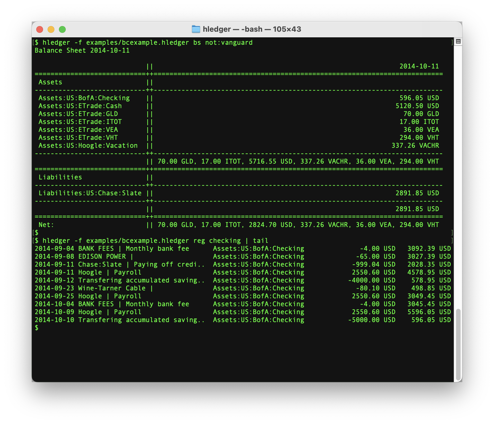
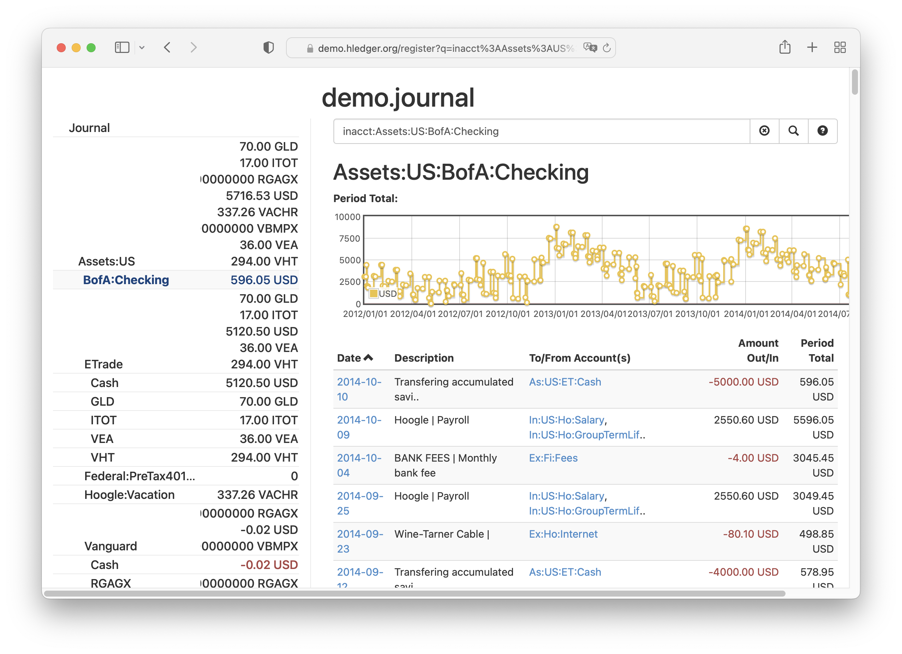

# hledger!
<div id="tagline">
Fast, robust, user-friendly<br>plain text accounting<br>⚡️💪🏼❤️
</div>

## hledger is...
- free GPL-licensed accounting software that runs on unix, mac, windows, and the web
- based on readable, version-controllable, future-proof plain text files
- good for tracking money, investments, time, or any countable commodity
- good for learning  more about [double entry accounting](accounting.md)
- shipped with [web](web.md), [terminal](ui.md), [command line](add.md), [JSON](https://hledger.org/hledger-web.md#json-api) and [Haskell](https://hackage.haskell.org/package/hledger-lib) interfaces
- the most user friendly [plain text accounting app](https://plaintextaccounting.org)
- comparable to [Ledger](ledger.md) and [Beancount](beancount.md)
- built with Haskell
- fast, lightweight, reliable (we pay $100 for [regression reports](http://hledger.org/regressionbounty))
- free from vendor lock-in
- local, not cloud-based; your private financial data remains under your control
- [scripting-friendly](scripting.md) and automatable
- comfortable for technical users, but also usable by others. Knowing about 
  [command lines](https://tutorial.djangogirls.org/en/intro_to_command_line/), 
  [text editors](https://www.codementor.io/@kmcgillivray/introduction-to-text-editors-and-the-command-line-j0upqatas) and 
  [version control](https://betterexplained.com/articles/a-visual-guide-to-version-control/) 
  is helpful, but not required (much)
- good at importing CSV from banks and other financial institutions
- actively developed and supported by [Simon Michael](http://joyful.com) and [contributors](CREDITS.md) since 2007
- strengthened by your [feedback](support.md), [work](CONTRIBUTING.md) and [funding](sponsor.md). 🙏🏻\

[Features](features.md) tells more, or don't hesitate to join [Discussion/Support](support.md) chat and ask questions.

[](https://github.com/simonmichael/hledger)
[](https://github.com/simonmichael/hledger/releases)
[](https://github.com/simonmichael/hledger/releases/latest)
[](http://hackage.haskell.org/package/hledger)
[](https://www.stackage.org/nightly/package/hledger)
\
[](https://github.com/simonmichael/hledger/actions/workflows/binaries-linux-x64-static.yml)
[](https://github.com/simonmichael/hledger/actions/workflows/binaries-mac-x64.yml)
[](https://github.com/simonmichael/hledger/actions/workflows/binaries-windows-x64.yml)
<!--
\

\

\


-->
<!--
\
\
\
\
-->

Welcome! This plain text accounting stuff is lots more fun than it sounds - care to give it a try ?
[Install](install.md), then see [Get Started](start.md), or the examples below,
or run `hledger` to see help and demos.

More documentation is ready when you need it, in the sidebar to the left; such as the\
[hledger](hledger.md), [hledger-ui](hledger-ui.md), [hledger-web](hledger-web.md) manuals,
[Cookbook](cookbook.md), [FAQ](faq.md) and [Videos/Talks](videos.md).
(If the sidebar is not visible, scroll up and click/tap the horizontal-lines icon at top left.)

## Examples

Here are three transactions in [journal format](hledger.md#journal-format),
recorded in the default [journal file](hledger.md#input)
by [`hledger add`](hledger.md#add) or [other means](create-a-journal.md):

```journal
# ~/.hledger.journal

2023-01-01 opening balances
    assets:bank:checking                $1000
    assets:bank:savings                 $2000
    assets:cash                          $100
    liabilities:credit card              $-50
    equity:opening/closing             $-3050

2023-02-01 GOODWORKS CORP
    assets:bank:checking           $1000
    income:salary

2023-02-15 market
    expenses:food             $50
    assets:cash
```

Each transaction's amounts must sum to zero.
One amount in each transaction can be omitted for convenience.
Accounts and currencies can be anything you like.

With no further setup, you can now run reports:
```shell
$ hledger cashflow -MTA
Cashflow Statement 2022-01-01..2022-02-28

                      ||   Jan    Feb    Total  Average 
======================++================================
 Cash flows           ||                                
----------------------++--------------------------------
 assets:bank:checking || $1000  $1000    $2000    $1000 
 assets:bank:savings  || $2000      0    $2000    $1000 
 assets:cash          ||  $100   $-50      $50      $25 
----------------------++--------------------------------
                      || $3100   $950    $4050    $2025 
```

However, it's useful to declare [account types](hledger.md#account-types) if you use non-english account names:
```journal
# ~/.hledger.journal

account actifs                          ; type:Asset
account actifs:banque:compte courant    ; type:Cash
account actifs:banque:compte d'épargne  ; type:Cash
account actifs:espèces                  ; type:Cash
account passifs                         ; type:Liability
account capitaux propres                ; type:Equity
account revenus                         ; type:Revenue
account dépenses                        ; type:Expense
```

Or all the valid accounts and currencies, if you want [full error checking](hledger.md#strict-mode):
```journal
# ~/.hledger.journal

commodity $1000.00

account assets                   ; type:A
account assets:bank              ; type:C
account assets:bank:checking
account assets:bank:savings
account assets:cash              ; type:C
account liabilities              ; type:L
account liabilities:credit card
account equity                   ; type:E
account equity:opening/closing
account income                   ; type:R
account income:salary
account income:gifts
account expenses                 ; type:X
account expenses:rent
account expenses:food
account expenses:gifts
```
```shell
$ hledger check --strict
$ 
```

Declaring accounts also helps set a meaningful [display order](hledger.md#account-display-order) (not just alphabetical):

```shell
$ hledger accounts -t
assets
  bank
    checking
    savings
  cash
liabilities
  credit card
equity
  opening/closing
income
  salary
  gifts
expenses
  rent
  food
  gifts
```

You can optionally declare [account aliases](hledger.md#alias-directive) to save typing:
```journal
# ~/.hledger.journal

alias chk  = assets:bank:checking
alias cash = assets:cash
alias card = liabilities:creditcard
alias food = expenses:food

...

2023-02-15 market
    food  $50
    cash
```

Instead of using the command line, you could run [`hledger-ui`](ui.md) or [`hledger-web`](web.md).
Here are the command line, terminal, and web interfaces, showing more complex data:

<a href="/images/cli-green-bs-reg.png" class="highslide" onclick="return hs.expand(this, { captionText:'The hledger command line interface.' })"></a>
<a href="/images/home-ui-3.png"        class="highslide" onclick="return hs.expand(this, { captionText:'The hledger-ui text user interface.' })"></a>
<a href="/images/web-bcexample.png"    class="highslide" onclick="return hs.expand(this, { captionText:'The hledger-web web user interface.' })"></a>

Here's a time log in  [timeclock format](hledger.md#timeclock-format):

```timeclock
# 2023.timeclock
i 2023/03/27 09:00:00 projects:a
o 2023/03/27 17:00:34
i 2023/03/31 22:21:45 personal:reading:online
o 2023/04/01 02:00:34
```
```
$ hledger -f 2023.timeclock register -D
2023-03-27   projects:a                         8.01h         8.01h
2023-03-31   personal:reading:online            1.64h         9.65h
2023-04-01   personal:reading:online            2.01h        11.66h
```

And one in [timedot format](hledger.md#timedot-format):

```timedot
# 2023.timedot
2023/2/1
biz:research  .... ..
fos:hledger   .... .... ....
2023/2/2
fos:ledger    0.25
fos:haskell   .5
biz:client1   2
```
```
$ hledger -f 2023.timedot balance -tDTA  # tree, Daily, Total, Average
Balance changes in 2023-02-01..2023-02-02:

            || 2023-02-01  2023-02-02    Total  Average 
============++==========================================
 biz        ||       1.50        2.00     3.50     1.75 
   client1  ||          0        2.00     2.00     1.00 
   research ||       1.50           0     1.50     0.75 
 fos        ||       3.00        0.75     3.75     1.88 
   haskell  ||          0        0.50     0.50     0.25 
   hledger  ||       3.00           0     3.00     1.50 
   ledger   ||          0        0.25     0.25     0.12 
------------++------------------------------------------
            ||       4.50        2.75     7.25     3.62 
```

Here are examples of:
- [HTML reports](report-examples.md#income-statement-2012-01-012014-10-11)
- [Charts and Graphs](charts.md)
- [Common workflows](common-workflows.md)
- [Scripting](scripting.md)
- [Mobile apps](mobile.md)
- [Importing CSV data](import-csv.md)
- [Import/export/interop with other software](cookbook.md#other-software)


hledger.org site tips: 

- Use the horizontal lines icon at top left to toggle the sidebar.
- Use the paintbrush icon to change theme.
- Use the magnifying-glass icon to search this site.
- [Access keys](https://en.wikipedia.org/wiki/Access_key#Access_in_different_browsers) are also available:\
  `s` toggle sidebar, `t` theme, `/` search,\
  `1` home page, `2` recent changes, `<` previous page, `>` next page.


<style>
#grabber {
  text-align:center;
  padding:1em 1em 0 1em;
/*  border:2px solid limegreen; */
  border-radius:8px; 
  margin:1em;
}
#grabber .heading {
  /*font-style: italic; */
  font-size:x-large;
  font-weight:bold;
}

.content h1 { 
  font-size: 5em;
  font-style: italic;
  text-align:center;
  margin: 0.5em 0 0;
  display:block;
}
/* 
.content h2 { 
  text-align:center;
  font-size: 2em;
  margin-top:2em; 
}
*/
#tagline {
  font-size:xx-large;
  font-style:italic; 
  text-align:center;
  margin:0 0 0.5em;
}

#leadingword {
  font-weight:bold;
  font-style:italic;
  font-size:x-large;
}

#screenshots td {
  border: 0 !important;
  padding: 0 2em 0 0;
}

code::first-line {
  font-weight:bold;
}
</style>
