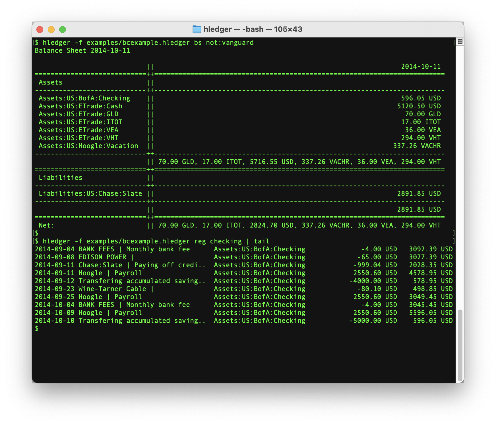
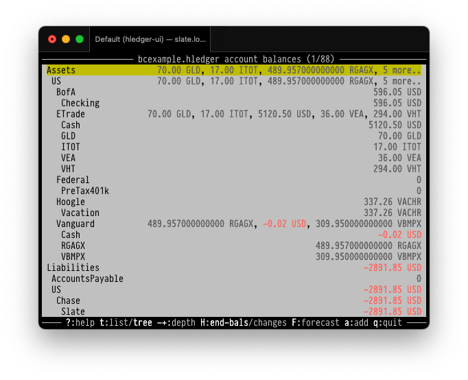

<link rel="stylesheet" href="https://fonts.googleapis.com/css2?family=Gabarito">
<style>
.content h1 {
  font-family: Gabarito;
  font-size: 6em;
  font-weight: normal;
  white-space:normal;
  text-align:center;
  margin: 0.5em 0 0;
  display:block;
}
.responsive-image {
  width: 25%;
  margin: 1em 1em;
  float: right;
}
@media (max-width: 500px) {
  .content h1 { font-size:20vw; }
  .responsive-image {
      float: none;
      display: block;
      width: 50%;
      margin: 1em auto;
  }
}
#tagline {
  font-size:xx-large;
  text-align:center;
  margin:0 0 0.5em;
}
.quote {
  width: 80%;
  margin: auto;
  text-align:center;
  font-style:italic;
  font-size:90%;
}
.quote-author { white-space:nowrap; }
code::first-line {
  font-weight:bold;
}
</style>


<div id="heading">

# hledger

<div id="tagline" style="margin-bottom:1em;">
Robust, friendly, fast,<br>plain text accounting.
</div>
</div>
<div style="display:flex; justify-content:center; align-items:flex-start; flex-wrap:wrap; margin-top:1em;">
<a  href="/images/cli-green-bs-reg.png" class="highslide" onclick="return hs.expand(this, { captionText:'The hledger command line interface.' })"
></a>
<a  href="/images/home-ui-3.png"        class="highslide" onclick="return hs.expand(this, { captionText:'The hledger-ui text user interface.' })"
></a>
<a  href="/images/web-bcexample.png"    class="highslide" onclick="return hs.expand(this, { captionText:'The hledger-web web user interface.' })"
></a>
</div>
<div id="quote" class="quote" title="Quote updates hourly.">
  <span id="quote-text"></span> <span id="quote-author" class="quote-author"></span>
</div>

<br>
<br>

----

**hledger** is friendly, fast, and dependable accounting software for tracking
money, investments, cryptocurrencies, time, or any countable commodity.
It uses human-readable **[plain text data](https://plaintextaccounting.org)** that you control.

You can import CSV data from banks, or enter data via web/terminal interfaces or your favorite text editor.
hledger provides powerful reports and scales smoothly from simple to sophisticated needs.
It works well with version control, scripts, and LLMs.
Read more at **[Why hledger ?](why.md)** and **[FAQ](faq.md)**.

### A quick example

Transactions are recorded in a plain text file.
This simple format, invented by the Ledger project, is the key
to understanding Plain Text Accounting and Double Entry Bookkeeping:

```journal
; ~/.hledger.journal (or $LEDGER_FILE)

2025-12-01 Starting balance
    equity            $-1000     ; <- $1000 moves from (-) the "equity" account
    assets:checking    $1000     ; <- to (+) the "assets:checking" account

2025-12-02 Grocery store
    assets:checking              ; <- a missing amount is inferred ($-64.50)
    expenses:groceries  $64.50

2025-12-03 Client payment
    income:consulting
    assets:checking    $1500

2025-12-04 Rent
    assets:checking
    expenses:rent     $800
```

This file is all you need. From it, hledger generates precise reports:

```
$ hledger aregister assets
Transactions in assets and subaccounts:
2025-12-01 Starting balance   equity                  $1000.00      $1000.00
2025-12-02 Grocery store      ex:groceries             $-64.50       $935.50
2025-12-03 Client payment     in:consulting           $1500.00      $2435.50
2025-12-04 Rent               ex:rent                 $-800.00      $1635.50
```
```
$ hledger balance
            $1635.50  assets:checking
           $-1000.00  equity
              $64.50  expenses:groceries
             $800.00  expenses:rent
           $-1500.00  income:consulting
--------------------
                   0
```
```
$ hledger is --pretty --tree --daily --row-total --average --begin 2025/12/2
Daily Income Statement 2025-12-02..2025-12-04

┌───────────────────╥────────────┬────────────┬────────────┬──────────┬─────────┐
│                   ║ 2025-12-02 │ 2025-12-03 │ 2025-12-04 │    Total │ Average │
╞═══════════════════╬════════════╪════════════╪════════════╪══════════╪═════════╡
│ Revenues          ║            │            │            │          │         │
├───────────────────╫────────────┼────────────┼────────────┼──────────┼─────────┤
│ income:consulting ║          0 │   $1500.00 │          0 │ $1500.00 │ $500.00 │
├───────────────────╫────────────┼────────────┼────────────┼──────────┼─────────┤
│                   ║          0 │   $1500.00 │          0 │ $1500.00 │ $500.00 │
╞═══════════════════╬════════════╪════════════╪════════════╪══════════╪═════════╡
│ Expenses          ║            │            │            │          │         │
├───────────────────╫────────────┼────────────┼────────────┼──────────┼─────────┤
│ expenses          ║     $64.50 │          0 │    $800.00 │  $864.50 │ $288.17 │
│   groceries       ║     $64.50 │          0 │          0 │   $64.50 │  $21.50 │
│   rent            ║          0 │          0 │    $800.00 │  $800.00 │ $266.67 │
├───────────────────╫────────────┼────────────┼────────────┼──────────┼─────────┤
│                   ║     $64.50 │          0 │    $800.00 │  $864.50 │ $288.17 │
╞═══════════════════╬════════════╪════════════╪════════════╪══════════╪═════════╡
│ Net:              ║    $-64.50 │   $1500.00 │   $-800.00 │  $635.50 │ $211.83 │
└───────────────────╨────────────┴────────────┴────────────┴──────────┴─────────┘
```

It can check for many kinds of error:

```
$ hledger check --strict
hledger: Error: /Users/simon/.hledger.journal:2:
  | 2025-12-01 Starting balance
2 |     equity                   $-1000
  |                              ^^^^^^
  |     assets:checking           $1000

Strict commodity checking is enabled, and
commodity "$" has not been declared.
Consider adding a commodity directive. Examples:

commodity $1000.00
commodity 1.000,00 $
```

The add command walks you through adding a transaction:

```
$ hledger add
Adding transactions to journal file /Users/simon/.hledger.journal
...
Date [2025-12-13]:
Description: groc
Using this similar transaction for defaults:
2025-12-02 Grocery store
    assets:checking            $-64.50
    expenses:groceries          $64.50

Account 1 [assets:checking]:
Amount  1 [$-64.50]: _
```

The get and import commands, suitably configured, can make importing from financial institutions simple.

```
$ hledger import --get
cd /Users/simon/finance/2026/data && getdata
getprices USD EUR 2026-01-01 2026-08-09 >/Users/simon/finance/2026/prices/EUR.prices
..
getprices USD VCEB 2026-01-01 2026-08-09 >/Users/simon/finance/2026/prices/VCEB.prices
...
running: simplefincsv ../data/simplefin.json 'chase bank'
running: paypalcsv ../data/paypal.json
archiving /Users/simon/finance/2026/data/archive/paypal.2026-08-09.csv
running: simplefincsv ../data/simplefin.json 'wells fargo.*business checking'
archiving /Users/simon/finance/2026/data/archive/wf-bchecking.2026-08-09.csv
running: simplefincsv ../data/simplefin.json 'wells fargo.*everyday checking'
archiving /Users/simon/finance/2026/data/archive/wf-pchecking.2026-08-09.csv
imported 8 new transactions from boi-ichecking.rules, chase.rules, paypal.rules, vanguard.rules, wf-bchecking.rules, wf-pchecking.rules to /Users/simon/finance/2026/2026.journal
```

hledger ui is a terminal UI, requiring less typing:

```
$ hledger ui --help
hledger-ui [OPTIONS] [--cash|--bs|--is|--all|--register=ACCT] [QUERY]
  browse accounts, postings and entries in a full-window TUI
...
```

hledger web is a web UI you can use locally or over the internet.
You can see a read-only instance with more complex data at 
**[demo.hledger.org](https://demo.hledger.org)**.

```
$ hledger web
...
Serving web UI and json API at IP address 127.0.0.1 (local access), port 5000
with base url http://127.0.0.1:5000
This server will exit after 2m with no browser windows open (or press ctrl-c)
Opening web browser...
```

The help command is a quick way to view docs.

```
$ hledger help impor
"impor" matches several manual sections; please be more specific:
  Deduplicating, importing
  import
  Default import sources
  Import dry run
  First import
  Importing balance assignments
  Import and commodity styles
  Import archiving
  Import special cases
  Import configurations to avoid
```
```
$ hledger help examples import

  Import new transactions from one or more data files to the main journal.
  More information: <https://hledger.org/hledger.html#import>.

  Import new transactions from `bank.csv`, using `bank.csv.rules` to convert:

      hledger import path/to/bank.csv

  Show what would be imported from these two files, without doing anything:

      hledger import path/to/bank1.csv path/to/bank2.csv --dry-run
...
```

### Get started

Try it for yourself:

- **[Install](install.md)** - quickly get hledger installed. Here are [release notes](relnotes.md).
- **[Docs](doc.md)** - many learning resources. **[hledger by example](hledger-by-example.md)** is another good place to start.
- **[Support](support.md)** - ask questions or share feedback.

### Get involved

Would you like to help ?

- **[Star us on Github](https://github.com/simonmichael/hledger/tree/main)**
  to help make us a [notable Haskell app](https://joyful.com/Haskell#What%20are%20some%20Haskell%20apps%20?).
- **[Sponsor hledger](sponsor.md)** to help sustain this work. Here's more about [Finance](FINANCE.md).
- **[Contributor Quick Start](CONTRIBUTING.md)** and **[Developer docs](dev.md)**.
- **[CREDITS](CREDITS.md)** shows many of the people who have contributed code over the years.

### Site tips

<ul>
<li> 

Use the three-lines button at the top of the page (or the **s** access key) to toggle the site navigation sidebar.

<li> 

[Access keys](https://en.wikipedia.org/wiki/Access_key#Access_in_different_browsers):
**1** home,
**2** changes,
**s** sidebar,
**t** theme,
**f** find,
**p** print,
**r** repo,
**e** edit \
You can also press the **left** or **right** arrow keys to step through pages.

<li>

For quicker browsing, you could configure these bookmark keywords in your browser.

<details><summary> Show: </summary>

- **h** PAGE  -> `https://hledger.org/PAGE.html`
- **hm** TOPIC -> `https://hledger.org/hledger.html#TOPIC`
- **hs** TOPIC -> `https://hledger.org/?search=TOPIC`
- **hi** NUM   -> `https://github.com/simonmichael/hledger/issues/NUM`
- **hinew**  -> `https://github.com/simonmichael/hledger/issues/new`
</details>
</ul>

<script src="js/quotes.js"></script>
