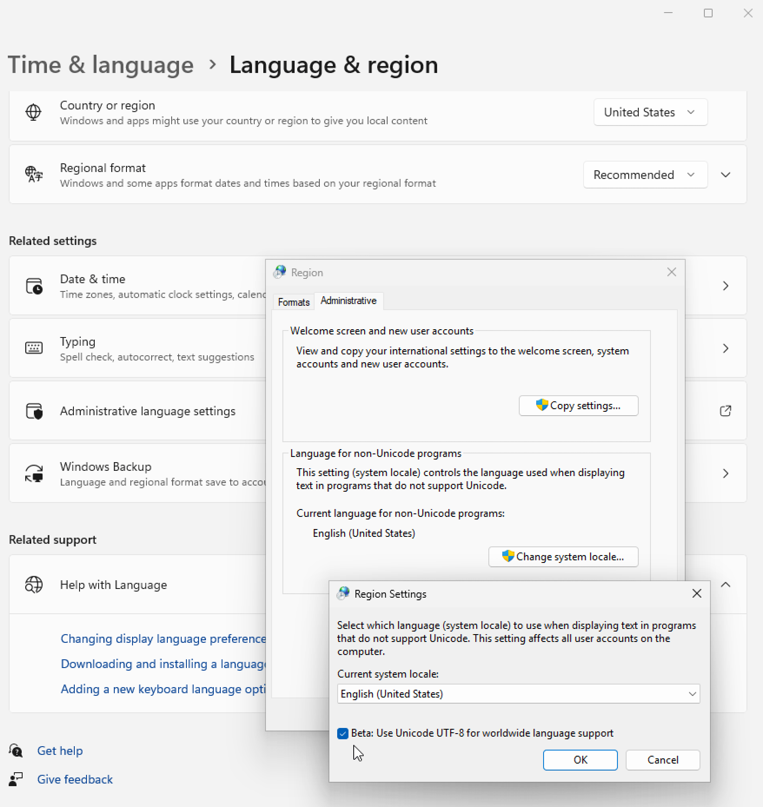

# Install

<div class=pagetoc>

<!-- toc -->
</div>

The current hledger release is **1.42.2**.
Here are the **[release notes](release-notes.md)**.

Here are several ways you can install hledger:

- Install [official binaries](#official-binaries) from Github. (Always up to date.)
- Install [packaged binaries](#packaged-binaries) using your package manager. (Sometimes less up to date.)
- Build your [own binaries](#build-from-source) from the hledger source code. (Requires about 4G of RAM & disk and some time.)

As the final step, [check your installation](#check-your-installation).

<!-- [Your feedback](support.md) helps make this process smoother. -->

## Official binaries

Official [release binaries] are provided for Linux, Mac, and Windows.
Here's an [ RSS feed](https://github.com/simonmichael/hledger/releases.atom).
\
Download them manually, 
or [use eget](https://github.com/zyedidia/eget?tab=readme-ov-file#how-to-get-eget) (recommended).
(For [prerelease binaries], add `--pre-release`):

[](https://github.com/simonmichael/hledger/releases/tag/1.42.2)
`eget simonmichael/hledger --all`

[release binaries]:    https://github.com/simonmichael/hledger/releases/tag/1.42.2
[prerelease binaries]: https://github.com/simonmichael/hledger/releases/tag/nightly

## Packaged binaries

Homebrew (Mac, Linux) <!-- chenrui ? --> \
[](https://formulae.brew.sh/formula/hledger)
`brew install hledger`

Docker (Linux, Mac, Windows) <!-- adept --> ([more](https://hub.docker.com/search?q=hledger&type=image&sort=updated_at&order=desc)) \
[](https://hub.docker.com/r/dastapov/hledger)
`docker pull dastapov/hledger`

Windows \
[](https://scoop.sh/#/apps?q=hledger)
`scoop install hledger` \
[](https://github.com/microsoft/winget-pkgs/tree/master/manifests/s/simonmichael/hledger)
`winget install -e --id simonmichael.hledger` \
[](https://community.chocolatey.org/packages/hledger)
`choco install hledger -y`
<!--
https://learn.microsoft.com/en-us/windows/package-manager/winget/#use-winget
https://github.com/microsoft/winget-cli/issues/210: Some users have reported isssues with the client not being on their PATH 
Installs to `C:\Users\Simon\AppData\Local\Microsoft\WinGet\Links\hledger.exe`.\
On ARM machines this runs via emulation (slower than normal).\
hledger-ui and hledger-web aren't available via winget yet.
-->

BSD \
[](https://www.freshports.org/search.php?query=hledger)
`pkg install hs-hledger hs-hledger-ui hs-hledger-web` \

`pkg_add hledger`

Nix (Linux, Mac) <!-- maralorn, chvp --> 
([Troubleshooting](https://hledger.org/hledger.html#troubleshooting),
[#1030](https://github.com/simonmichael/hledger/issues/1030),
[#1033](https://github.com/simonmichael/hledger/issues/1033),
[#2089](https://github.com/simonmichael/hledger/issues/2089)) \
[](https://search.nixos.org/packages?channel=unstable&from=0&size=50&sort=relevance&type=packages&query=hledger)
`nix-shell -p hledger hledger-ui hledger-web` 

GNU/Linux \
Alpine <!-- dhruvin --> \
[](https://pkgs.alpinelinux.org/packages?name=hledger*&branch=edge)
`doas apk add hledger hledger-ui hledger-web`\
[](https://pkgs.alpinelinux.org/packages?name=hledger*&branch=v3.21)\
[](https://pkgs.alpinelinux.org/packages?name=hledger*&branch=v3.20)\
[](https://pkgs.alpinelinux.org/packages?name=hledger*&branch=v3.19)\
[](https://pkgs.alpinelinux.org/packages?name=hledger*&branch=v3.18)\
Arch \
[](https://archlinux.org/packages/extra/x86_64/hledger/)
`pacman -Sy hledger hledger-ui hledger-web` \
Debian <!-- Clint --> ([more](https://packages.debian.org/search?searchon=names&keywords=hledger)): \
[](https://packages.debian.org/unstable/hledger)
`sudo apt install hledger hledger-ui hledger-web`\
[](https://packages.debian.org/testing/hledger)\
[](https://packages.debian.org/stable/hledger)\
[](https://packages.debian.org/oldstable/hledger)\
Fedora ([more](https://src.fedoraproject.org/rpms/hledger)) \

`sudo dnf install hledger`\
\
\
\
\
Gentoo <!-- ezzie --> \
[](https://gentoo.zugaina.org/Search?search=hledger)
`sudo eselect repository enable haskell && sudo emerge hledger hledger-ui hledger-web` \
Raspberry Pi <!-- nobodyinperson --> \

[hledger-linux-arm32v7.zip](https://github.com/simonmichael/hledger/releases/tag/1.22.1) \

[hledger-aarch64-manjaro.gz](https://github.com/simonmichael/hledger/releases/tag/1.18.1) ,
[hledger-armhf32-debian.gz](https://github.com/simonmichael/hledger/releases/tag/1.18) (unaudited) \
Ubuntu ([more](https://packages.ubuntu.com/search?suite=all&searchon=names&keywords=hledger)) \
[](https://packages.ubuntu.com/oracular/hledger)
`sudo apt install hledger hledger-ui hledger-web`\
[](https://packages.ubuntu.com/noble/hledger) \
[](https://packages.ubuntu.com/jammy/hledger) \
[](https://packages.ubuntu.com/focal/hledger) \
[](https://packages.ubuntu.com/bionic/hledger)\
Void \
[](https://voidlinux.org/packages/?q=hledger)
`xbps-install -S hledger hledger-ui hledger-web`

Sandstorm (web) \
[](https://apps.sandstorm.io/search?term=hledger)
[HLedger Web sandstorm app](https://apps.sandstorm.io/app/8x12h6p0x0nrzk73hfq6zh2jxtgyzzcty7qsatkg7jfg2mzw5n90)
<!-- jacob weisz -->


## Build from source

<!--
Issues with cli snippets in hledger.org code blocks:

- Wrap long lines with \ to make them visible without scrolling on the website.
- When multiple lines are copy/pasted from the website to a terminal, only the first runs (because of ^J's ?)
  Insert ;\ between lines to work around.

```
echo a
echo b
```
-->

<!--
[hledger-install.sh][hledger-install] is an automated install script that requires only [bash].
This is a good choice if you are not used to building Haskell software
(and if you are using a unix-based system, not Windows).
hledger-install.sh downloads Haskell build tools if needed,
then builds the current release of the hledger tools, plus a number of [add-on tools](scripts.md),
and installs them in ~/.local/bin. (Or ~/.cabal/bin, if you had cabal and not stack installed.)
```
curl -O https://raw.githubusercontent.com/simonmichael/hledger/master/hledger-install/hledger-install.sh
less hledger-install.sh   # <- good practice: inspect scripts before running
bash hledger-install.sh
```
-->

<!--
#### Build with stack

```
stack update
stack install hledger-1.42.2 hledger-ui-1.42.2 hledger-web-1.42.2 \
  --resolver=nightly-2025-05-01 --verbosity=error
```

stack will install a compatible version of the GHC compiler if needed,
perhaps using ~2G of disk space (under `~/.ghcup` if it is configured to use ghcup, otherwise under `~/.stack`).
Then it will build the hledger tools and install them in `~/.local/bin`.

`cabal` is the other popular Haskell build tool.
You can install it with your system package manager, or with [ghcup]
You will also need to install a version of GHC that can build current hledger;
usually any version newer than 8.10.7 will do.
Or, you can install both of these with [ghcup].

Then run:

```
cabal update
cabal install hledger-1.42.2 hledger-ui-1.42.2 hledger-web-1.42.2
```

This will build the hledger tools and install them in `~/.cabal/bin`.
-->

Building hledger requires the GHC compiler and either the stack or cabal build tool
which you can install with your package manager (brew, apt, winget..), with [ghcup], or with [stack] (simplest).
Or, you can use docker. All this may need perhaps 4G of RAM and 4G of disk space.

### On Mac

You will need the XCode Command Line Tools. Homebrew or macports will probably also be helpful.

Old issues:
- [mac m1: building with ghc 9+ requires extra include dir](https://gitlab.haskell.org/ghc/ghc/-/issues/20592)


### On Unix/Linux

You will need a system locale with a [text encoding](#text-encoding) configured; it might need to be UTF-8.
You may also need to install extra C libraries, to avoid build errors like "*cannot find -ltinfo*". Eg:
- On Debian or Ubuntu: `sudo apt install libgmp-dev libtinfo-dev zlib1g-dev`
- On Fedora or RHEL: `sudo dnf install gmp-devel ncurses-devel zlib-devel`

Get the [hledger source code](https://github.com/simonmichael/hledger/commits/master) with [git](https://git-scm.com):

    git clone https://github.com/simonmichael/hledger
    cd hledger
    git checkout 1.42.2   # switch to the latest release tag (optional)

Then build and install with stack:

    stack update; stack install

or with cabal:

    cabal update; cabal install all:exes

or with docker:

    cd docker; ./build.sh   # or build-dev.sh to keep build artifacts

Old issues:
- [arch: haskell build advice from Arch wiki](https://wiki.archlinux.org/index.php/Haskell)
- [openbsd 6: exec: permission denied](https://deftly.net/posts/2017-10-12-using-cabal-on-openbsd.html)
- [openbsd: stack install tips](https://github.com/commercialhaskell/stack/issues/3313#issuecomment-570353913)

### On Windows

These notes are for Windows 11.
On Windows, stack is the easiest way to get the haskell tools.
(Though if you are on a Windows ARM machine, stack will install slow x86_64 versions of the tools, and build slow x86_64 hledger binaries.)

First, apply all windows updates (to get the latest TLS certificates for network requests).

Install [stack] - in a command or powershell window, run:

    winget install -e --id commercialhaskell.stack

Install [git]:

    winget install -e --id Git.Git

Get the hledger source:

    git clone https://github.com/simonmichael/hledger
    cd hledger
    git checkout 1.42.2   # switch to the latest release tag (optional)

Build and install hledger:

    stack update
    stack install

On Windows, this may die repeatedly with a "... permission denied (Access is denied.)" error; 
we [don't know why](https://github.com/commercialhaskell/stack/issues/2426).
Just run it again to continue (press up arrow, enter).

On Windows, things work best if you build in the environment where you will use hledger.
Eg don't build it in a WSL or MINGW window if you plan to use it in CMD or Powershell.

Old issues:
- [windows: cross-environment non-ascii display issues](https://github.com/simonmichael/hledger/issues/961#issuecomment-471229644)

### On Nix

Old issues:
- [nix: nix install on linux can fail with "cloning builder process: Operation not permitted"](https://github.com/simonmichael/hledger/issues/1030)
- [nix: on Linux, nix-installed hledger won't handle non-ascii data](https://github.com/simonmichael/hledger/issues/1033)

### On Android

Here's 
[how to build hledger on Android with Termux](https://libera.ems.host/_matrix/media/r0/download/libera.chat/51835530d2b9eed094096d8a2c79e03dda2c35fb),
if your phone has plenty of memory.

### Build tips

- Building the hledger tools and possibly all their dependencies could take anywhere from a minute to an hour.
- On machines with less than 4G of RAM, the build may use swap space and 
  take much longer (overnight), or die part-way through. 
  In such low memory situations, try adding `-j1` to the stack/cabal install command, 
  and retry a few times, or [ask](support.md) for more tips.
- You could build just the hledger CLI to use less time and space: instead of `stack install`, run `stack install hledger`
- It's ok to kill a build and rerun the command later; you won't lose progress.
- You can add `--dry-run` to the install command to see how much building remains.

## Check your installation

If your hledger is new enough (a pre-release), you should now run:

    hledger setup

to check your setup. If this doesn't work, read on..

### PATH

After installing, try to run the hledger tools (hledger, hledger-ui, hledger-web) and look for the expected versions. Eg:

    $ hledger --version
    hledger 1.42.2, mac-aarch64

If this doesn't work, you may need to add the binaries' install directory to your shell's PATH.

stack or cabal show the install directory in their output, and warn you if it is not in PATH.
It could be, eg:
- `~/.local/bin` or `C:\Users\USER\AppData\Roaming\local\bin\` (stack) 
- `~/.cabal/bin` or `C:\Users\USER\AppData\Roaming\cabal\bin\` (cabal) 

On unix, these commands will add both bin directories to PATH permanently (probably):

    echo "export PATH=~/.local/bin:~/.cabal/bin:$PATH" >> ~/.profile
    source ~/.profile

On Windows, here's [how to set environment variables](https://www.devdungeon.com/content/set-environment-variables-windows).

<!--
You can run the built-in unit tests if you'd like:

    $ hledger test
    ...
    All 234 tests passed (0.04s)

or the more thorough functional tests, if you are set up for working with the hledger source code:

    $ just functest
    ...
     Total   1133 ...
    functest PASSED
-->

<a name="locale"></a> <!-- required permalink, maybe used in some error messages -->
<a name="text-encoding"></a> <!-- newer required permalink, used elsewhere -->

### Text encoding

hledger expects non-ascii input to be decodable with the system locale's text encoding;
usually if you try to read a file with a text encoding different from the system encoding, it will fail.
This also applies to the Haskell build tools, if you are building hledger from source.

How likely is this to affect you ? It depends on your platform and the data you are working with:

- On Mac, the system encoding is always UTF-8.
  You'll notice this problem only if you try to process files in a foreign encoding,
  eg received from a Windows user.

- On Windows, the system encoding varies by region.
  If you are working with your own data, you won't notice this problem.
  If you are on Windows 11 and often need to share files with mac/unix systems,
  there is a setting for UTF-8 encoding which you might want to enable.

- On GNU/Linux and other unix systems, the system encoding varies, and is sometimes none.
  You should ensure that at least some encoding is configured, so that you can work with non-ascii data.
  It may be controlled by the `LANG` environment variable, or in other ways.

If you hit this problem, you can 

- configure your system encoding to match the files you usually work with, if feasible. If you're not sure which encoding to use, pick UTF-8.
- or, convert the files to your system's text encoding. Use `iconv` on unix/mac, powershell or notepad on Windows.
- or, use the CSV [`encoding`](hledger.md#encoding) rule to auto-convert CSV(/SSV/TSV) files.

Here's an example. Let's say you want to work with UTF-8 text on a GNU/Linux system,
but it's configured with the C locale, which can only handle ASCII text:

```cli
$ echo $LANG
C
```

So, first check that you have a UTF-8-capable locale installed (`locale -a`).
If not, install one (perhaps by using your package manager, 
perhaps by uncommenting it in `/etc/locale.gen` and running `locale-gen`).

Then change the system locale. 
Here's one common way to set it permanently for your shell.
Note exact punctuation and capitalisation of locale names is important on some systems.
```cli
$ echo "export LANG=C.utf8" >>~/.profile    # or en_US.UTF-8, fr_FR.utf8, etc.
# close the shell/terminal window and open a new one
$ echo $LANG
C.UTF-8
```

For Nix users, the procedure is [different](https://github.com/simonmichael/hledger/issues/1033#issuecomment-1062506027),
eg you might need to set `LOCALE_ARCHIVE` instead.
Likewise for GUIX users.

Windows users who want to use UTF-8 encoding, eg to interoperate with unix systems,
might find the "Use Unicode UTF-8 for worldwide language support" setting helpful.
Here's where it is in Windows 11:

Though it might cause problems with some older applications, including some GUI programs.

Here's a way to select UTF-8 for Windows Terminal and PowerShell, without affecting the entire system: 
add this line to the PowerShell profile file:
```conf
$OutputEncoding = [console]::InputEncoding = [console]::OutputEncoding = New-Object System.Text.UTF8Encoding
```


### Completions

If you use the bash or zsh shells, you can set up context-sensitive auto-completions for hledger command lines.
(Here's how to [contribute other shells](https://github.com/simonmichael/hledger/tree/master/hledger/shell-completion#completions-for-other-shells).)

#### bash

1. Ensure that [bash-completion](https://salsa.debian.org/debian/bash-completion) is installed and enabled:

    On a Mac, using homebrew:
    - `brew remove -f bash-completion`
    - `brew install bash-completion@2`
    - Add the suggested line to your ~/.bash_profile, if it's not already there
    - `source ~/.bash_profile` (or open a new bash shell)

    On GNU/Linux:
    - `apt install bash-completion`
    - `source ~/.bash_profile` (or open a new bash shell)

2. Install hledger with your system package manager (`brew install hledger`, `apt install hledger` or similar).

    Now completions may be working.

    If not, eg because your system's hledger package does not yet include the bash completions, or if they are not up to date, 
    or if you have installed hledger by other means, then install the 
    [latest hledger bash completions](https://raw.githubusercontent.com/simonmichael/hledger/1.42-branch/hledger/shell-completion/hledger-completion.bash)
    yourself, under your XDG_DATA_HOME directory. Eg:

    ```
    curl https://raw.githubusercontent.com/simonmichael/hledger/1.42-branch/hledger/shell-completion/hledger-completion.bash \
      -o ~/.local/share/bash-completion/completions/hledger --create-dirs
    ```

Here's what the bash completions should complete when you press TAB once or twice in a command line:

Before the command argument:
- the "hledger", "hledger-ui" and "hledger-web" executable names
- general flags and flag values
- hledger's command argument.
  Eg `hledger <TAB><TAB>` should list all hledger commands, and `hledger b<TAB><TAB>` should list the ones starting with b.

After the command argument:
- command-specific flags and flag values
- account names
- query prefixes, like `payee:` or `status:`
- valid query values after these query prefixes: `acct:`, `code:`, `cur:`, `desc:`, `note:`, `payee:`, `real:`, `status:`, `tag:`.
  Eg `hledger reg acct:<TAB><TAB>` should list your top-level account names.
- amount comparison operators after `amt:`.

When a completion includes special characters, backslashes will be inserted automatically; this does not work right in all cases.

#### zsh

1. Ensure that [zsh-completions](https://github.com/zsh-users/zsh-completions/tree/0adf2f053ece56262ad8a173678add97c8ca4042) is installed and enabled.
2. ? [discussion](https://www.reddit.com/r/plaintextaccounting/comments/1iqqpgg/hledger_shell_completions_for_zsh/)


## Next steps

Nicely done! Now see [Get started](start.md),
or come to the [#hledger chat](support.md)
where we'll gladly share tips or receive your feedback.


[ghc]:             https://www.haskell.org/ghc
[bash]:            https://en.wikipedia.org/wiki/Bash_%28Unix_shell%29
[make]:            https://www.gnu.org/software/make/
[ghcup]:           https://haskell.org/ghcup
[stack]:           https://docs.haskellstack.org/en/stable/
[cabal]:           https://cabal.readthedocs.io/en/stable/
[hledger-install]: https://github.com/simonmichael/hledger/blob/master/hledger-install/hledger-install.sh
[WSL]:             https://en.wikipedia.org/wiki/Windows_Subsystem_for_Linux
[nix]:             https://nixos.org
[git]:             https://en.wikipedia.org/wiki/Git
