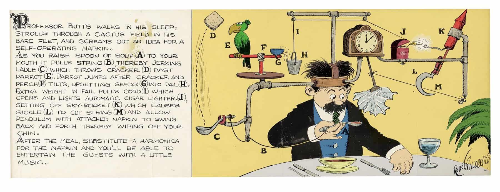
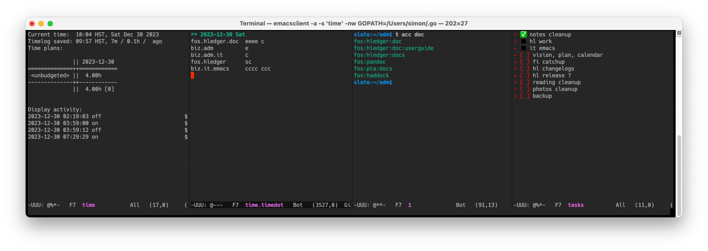

# SM's time & task dashboard

<a href="self-operating-napkin.jpg" class="highslide" 
onclick="return hs.expand(this, { captionText:'Rube Goldberg\'s Self-operating Napkin' })"
></a>

<!-- *2023-12-23: sm makes a cool rube goldberg dashboard with HotKey, Hammerspoon, Terminal, emacs, vterm, just, watchexec, hledger, Obsidian and emojis* -->

SM has invented a cool time and task-tracking aid. As you work on a mac computer (**A**), you wonder how long you have been here and what you should be doing instead. So you press Cmd-Shift-Return to call up your Time and Task Dashboard (**B**). The HotKey app (**C**) recognises your keypress and opens Terminal (**D**), which previously you positioned at top half of screen by pressing Ctrl-Opt-Cmd-Up to trigger a Hammerspoon window layout script (**E**). Inside the Terminal (**D**) is a text-mode Emacs (**F**) which you have split horizontally with Ctrl-x 3 into four side-by-side windows (**G**, **H**, **I** and **J**). In the first window (**G**), a vterm (**K**) is running a `time` script (**L**), which is defined in a justfile (**M**) and uses watchexec (**N**), cron (**O**), hledger (**P**) and various unix tools (**Q**) to show an updating time report (**R**).  You review this to see where you have spent time today, your time goals if any, and how long it has been since you last updated the time log and since the computer woke up. Armed with this information you make any needed updates to your timedot-format time log (**S**), which is in the second window (**H**), usually narrowed to the current day. If you need to run reports or queries, you use the third window (**I**) which contains an emacs shell prompt (**T**). You have also been keeping more detailed notes and todo lists in a weekly notes file (**U**), named like `2023W51.md`, with Obsidian (**V**). To see today's goals and progress summarised, you glance at the fourth window (**J**), where a second vterm is running a `todo` script (**W**), also defined in justfile (**M**), showing an updating tasks report (**X**). This displays the list items from today's section of the weekly notes file (**U**) with empty checkboxes in red, filled checkboxes as green check marks, and non-checkbox bullets as black squares. You review today's green completed tasks, red uncompleted tasks and black unplanned activities. Reoriented and up to date, you press Cmd-Shift-Return again to hide the Terminal (**D**), and proceed with clarity and confidence.

<a href="time-and-task-dashboard.png" class="highslide" 
onclick="return hs.expand(this, { captionText:'SM\'s time and task dashboard' })"
></a>


\
`time` (**L**):
```bash

# Defined in ~/.bash_profile.local: $TIMELOG, $TIMEDATA

TIMEDIR     := `dirname "$TIMELOG"`
TIMELOGALL  := TIMEDIR / 'time-all.journal'

# This redisplays only when a file listed by `hledger -f $TIMELOG files` is modified.
# To force a per minute display as well, have $TIMELOG include a dummy file (.tick)
# and configure a cron job to touch that every minute.
# (This is better than touching the timelog file itself, which confuses editors.)
#

# show time status, redisplaying when timelog files change
time *ARGS:
    #!/usr/bin/env bash
    set -euo pipefail
    cd "$TIMEDIR"
    opts=  #--poll=10  # <- uncomment to fix symlinked files being ignored
    $WATCHEXEC $opts --no-vcs-ignore \
      --filter-file=<(hledger -f "$TIMELOG" files | sed -E "s|$TIMEDIR/||g") \
      -c -r just time1 "$@"

# show time status, redisplaying every minute with watch
# dash-1m *ARGS:
#     watch -n60 -c tt status
# }

# show current time status
time1 *ARGS:
    #!/usr/bin/env bash
    # XXX changing the above to osh causes tdash to hang
    set -euo pipefail
    date=$(if [ "$(builtin type -p gdate)" ]; then echo gdate; else echo date; fi)
    stat=$(if [ "$(builtin type -p gstat)" ]; then echo gstat; else echo stat; fi)
    curtime=$($date +'%H:%M %Z, %a %b %-e %Y')
    modtime=$($date +'%H:%M %Z' -r "$TIMEDATA")
    modsecs=$($stat -c %Y "$TIMEDATA")
    nowsecs=$($date +%s)
    agesecs=$((nowsecs - modsecs))
    agemins=$(python3 -c "print($agesecs/60)")
    agehrs=$(python3 -c "print($agesecs/3600.0)")
    ageqtrhrs=$(python3 -c "print(round($agesecs/900.0))")
    agedots=$(just tdots "$ageqtrhrs")
    printf "Current time:  %s\n" "$curtime"
    # old, for osh: use env here to run the system printf, which supports floating point
    env printf "Timelog saved: %s, %.0fm / %.1fh / %s ago\n" "$modtime" "$agemins" "$agehrs" "$agedots"
    # Show the current day/week/month budget status.
    printf "Time plans:\n"

    # calculate each period's budget from daily budget
    hledger -f "$TIMELOG" bal -1 -p 'daily today'        --budget=Daily -E "$@" | tail +2
    # hledger -f "$TIMELOG" bal -1 -p 'weekly this week'   --budget=Daily -E "$@" | tail +2
    # hledger -f "$TIMELOG" bal -1 -p 'monthly this month' --budget=Daily -E "$@" | tail +2

    # or use each period's specific budget
    # hledger -f "$TIMELOG" bal -p 'daily today'        --budget=Daily   -1 | tail +2
    # hledger -f "$TIMELOG" bal -p 'weekly this week'   --budget=Weekly  -1 | tail +2
    # hledger -f "$TIMELOG" bal -p 'monthly this month' --budget=Monthly -1 | tail +2

    echo
    hledger -f "$TIMELOG" check -s tags ordereddates || true
    # this comes last because it's slow and variable length
    echo
    printf "Display activity:\n"
    wakelog today | tail -n 6
```

\
`todo` (**W**):
```bash
# keep these synced with obsidian:

WEEKNOTES := '~/notes/CLOUD/`date +%YW%V`.md'
TODAYHEADING := '^## ' + `date +'%a %-d'`

# print the path of this week's notes file
@weeknotes:
    echo {{ WEEKNOTES }}

# watch today's tasks, with any rg options (like -c)
@todo *OPTS:
    if [[ ! -f {{ WEEKNOTES }} ]]; then echo "{{ WEEKNOTES }} does not exist yet"; exit 1; fi
    $WATCHEXEC -w {{ WEEKNOTES }} -- 'clear; just todo1 {{ OPTS }}'

# list tasks in today's notes (checkboxes and other bullet items)
@todo1 *OPTS:
    if [[ ! -f {{ WEEKNOTES }} ]]; then echo "{{ WEEKNOTES }} does not exist yet"; exit 1; fi
    awk '/^#+ Inbox/{f=0};f;/{{ TODAYHEADING }}/{f=1}' {{ WEEKNOTES }} \
    | sed 's/\[x]/✅/' \
    | gsed -E 's/- (\w)/- ◼️  \1/' \
    | rg {{ OPTS }} '^ *\- (\[[ x]\])?' \

# list tasks in this week's notes
@todo-week *OPTS:
    rg {{ OPTS }} '^ *\- (\[[ x]\])?' {{ WEEKNOTES }}
```

\
`wakelog`:
```bash
#!/usr/bin/env bash
# Show notable mac sleep/wake events, trimmed to terminal width
# for tidy display, eg by watch. 
# Requires: cut grep sed tput
# XXX slow

usage() {
    cat <<EOF
Show notable mac sleep/wake events, trimmed to terminal width.
Commands: 
wakelog today     - show main sleep/wake events so far today
wakelog yesterday - show main sleep/wake events yesterday
wakelog list      - show main recent sleep/wake events
wakelog all       - show all recent sleep/wake events

EOF
# ^ keep synced with functions below
}

# XXX in some cases this might not work, then the log lines are not cut,
# and their long trailing whitespace can cause lines to wrap.
width=$(tput cols)

grep="grep -E"
grep="rg --color=never"

today() {
    list | $grep "$(date +^%Y-%m-%d)"; true
}

yesterday() {
    list | $grep "$(date -v-1d +^%Y-%m-%d)"; true
}

listv() { # list simplified sleep/wake/display off/on events from mac power event log
    pmset -g log | $grep '((Sleep|Wake)  +|Display is)' \
    | sed -E \
      -e "s/\t/ /g" \
      -e 's/(Notification|Sleep|Wake) *	//' \
      -e 's/is turned //' \
      -e 's/Entering Sleep state/Sleep/' \
    | $grep -v '(DarkDarkWake|Maintenance Sleep|Back to Sleep)' \
    | cut -c 1-"$width"  # clip long lines
}

list() { # list terse display off/on events from mac power event log
    pmset -g log | rg '^(...................).*Display is turned (.*)' -or'$1 $2' \
    | sed -E \
      -e "s/\t/ /g" \
    | cut -c 1-"$width"
}

all() {
    pmset -g log \
    | $grep -e " Sleep " -e " Wake " -e " DarkWake " -e " Wake Requests " \
    | sed -E -e "s/\t/ /g" \
    | cut -c 1-"$width"
}

if declare -f "$1" > /dev/null; then "$@"; else usage; fi
```
