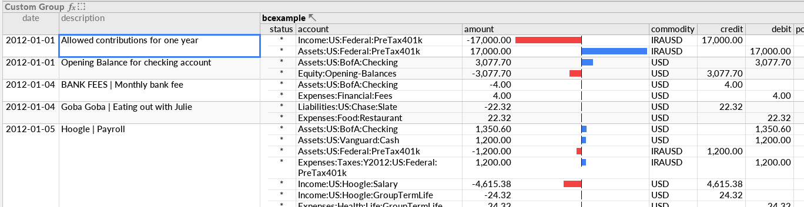
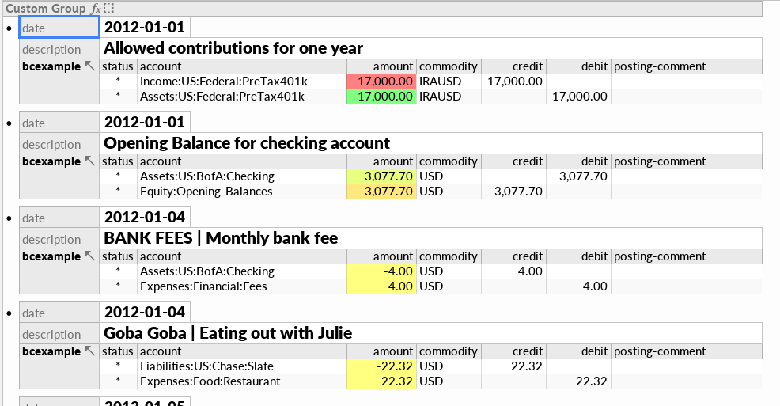

# hledger and Ultorg

[Ultorg](https://www.ultorg.com/) provides a slick visual UI for relational data.
It is an easy and powerful way to visualise and analyse your hledger data in a tabular GUI.

<a href="images/ultorg-1.png" class="highslide" onclick="return hs.expand(this)"></a>

<a href="images/ultorg-2.png" class="highslide" onclick="return hs.expand(this)"></a>

Ultorg goes farther than spreadsheets, with more powerful joins and layout.
<https://www.ultorg.com/resources> > 1st video demonstrates its key features,
and the 3rd video is a fascinating demo of analysing Quickbooks data.

## Exporting to Ultorg via CSV

This method is perhaps the easiest.

1. Export a hledger journal as CSV, eg:
    ```shell
    $ hledger -f examples/bcexample.hledger print -o examples/bcexample.csv
    ```
    or
    ```shell
    $ hledger print -o main.csv
    ```

2. Run Ultorg.

3. Click Add Data Source in the left panel, click Connect to File, and select the CSV file. Press enter to confirm the import settings.

4. The CSV file appears in the left panel, containing one table. Double-click on the table to open it in the main pane.

5. Group the txnidx, date, and fescription columns: cmd/ctrl-click their headings, and from from the headings' drop-down/right-click menu, choose Custom Group (CMD-I).

6. Sort by date: in date column heading, right-click > Sort Ascending.

7. Hide uninteresting columns such as txnidx and Row Number: select by clicking headings, right-click -> Hide (CMD-SHIFT-K).

## Exporting to Ultorg via SQlite

The results are much the same as the above, though you will also have an SQLite database to play with (see [hledger and SQLite](sqlite.html)).
This method requires Ultorg >=1.26. Note also [ultorg#53](https://github.com/ultorg/public_issues/issues/53).

1. Export a hledger journal as an Sqlite database. Eg:
    ```shell
    $ hledger -f examples/bcexample.hledger print -O sql | sqlite3 bcexample.db
    ```
    or
    ```shell
    $ hledger print -O sql | sqlite3 main.db
    ```

2. Run Ultorg.

3. Click Add Data Source in the left panel, click Connect to File, and select the .db file.

4. The db file appears in the left panel, containing one table. Double-click on the table (Postings) to open it in the main pane.

5. Group the Txnidx, Date 1, and Description columns: cmd/ctrl-click their headings, and from from the headings' drop-down/right-click menu, choose Custom Group (CMD-I).

6. Sort by date: in Date 1 column heading, right-click > Sort Ascending.

7. Hide uninteresting columns such as Txnidx, ID, Date2, Code, Posting Status: select by clicking headings, right-click -> Hide (CMD-SHIFT-K).

## Things to try

8. Click the Amount column, then click the toolbar button that (by default) looks like a bar chart.

9. Click the toolbar button that (by default) looks like a table and select a different Auto-Layout Type, like Form (Multi-Column).
